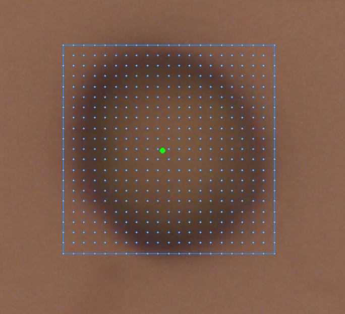
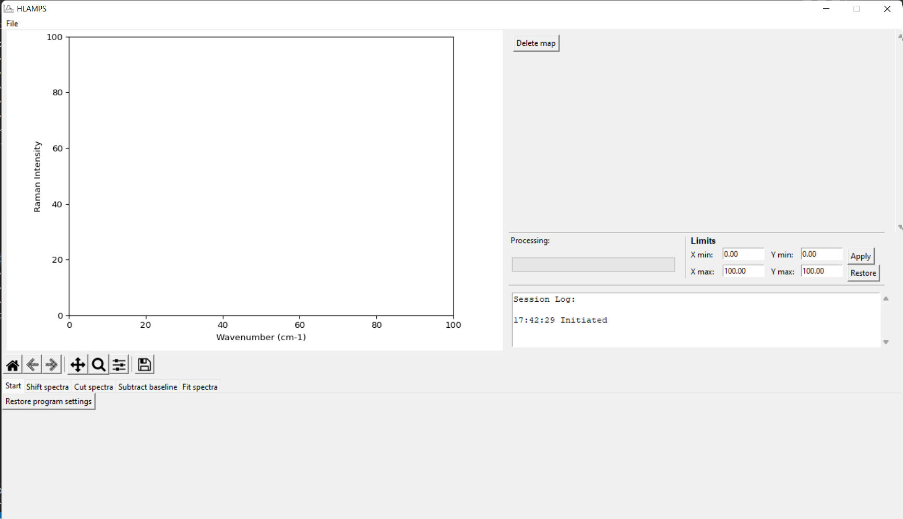
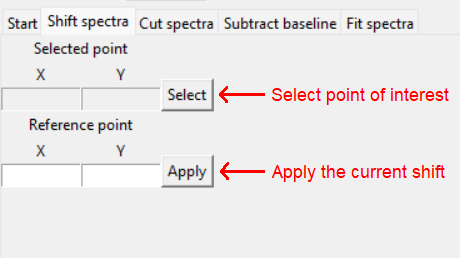
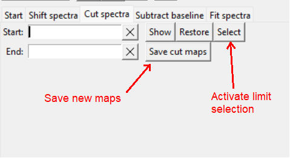
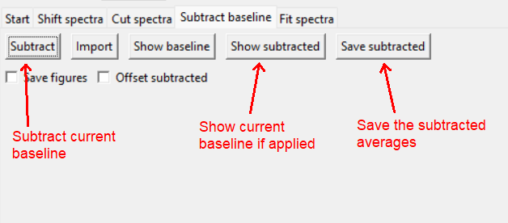
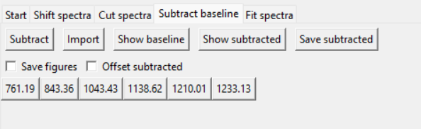
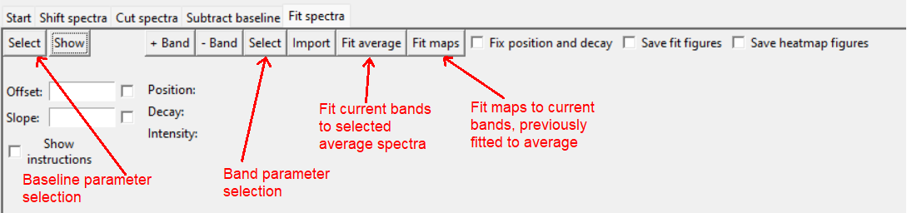
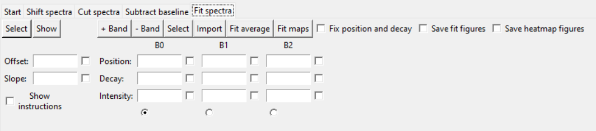

# HLAMPS
## Horiba LabSpec Automatic Map Processing Software

#### Video Demo:  <URL HERE>
#### Description:

This software is a complement of the [LabSpec6](https://www.horiba.com/aut/products/detail/action/show/Product/labspec-6-spectroscopy-suite-software-1843/ "Horiba LabSpec6 Spectroscopy Suite") adquisition and processing software. It performs automatic batch processing of square/rectangular maps.

LabSpec6 adquisition software has several mapping modes. We focus primarily in the square/rectangular spatial maps. The image below illustrates the setup of a map:

In each grid point, a [Raman spectrum](https://en.wikipedia.org/wiki/Raman_spectroscopy "Wikipedia article") is adquired, which contains the fingerprint of the molecules present in that area. While LabSpect has some map processing capabilities, it doesn't have band fintting capabilities, which is key to identifiy each component of the total spectra. HLAMPS comes to ease the batch processing of all these spectra, given that each map could contain thousands of spectra, making it impossible to process manually.

For HLAMPS, each map has to be exported or saved as a single .txt file from LabSpec6. To process several maps at the same time, they have to have the same frequency range and equivalent vibrational bands.

HLAMPS has matplotlib backend enabled to display the average spectra plot for each map and has a backend enabled to handle mouse clicking in the plot, to adjust parameters for processing.

When opening maps, if the map filenames are longer than 80 characters, the user is prompted to give aliases to the opened maps. This is done to ensure that the path length limit is safely distant, regardless of the current computer's setup.

HLAMPS works considering arbitrarily large maps, which is the reason of the choice to not mantain the maps' data loaded while the program is running. When the data is needed, the program loads is as it is requested and then unloads it. It also remembers the last state to know which file to look for when permanent changes are made.

On opening maps, the avergae spectra for each is displayed in the matplotlib plot and a legend appears with the map names or aliases. It also comes with a progress bar that is used for potentially long processes involving all the maps' spectra, to avoid user panic while the program runs.

There is a dynamic display of the current axes limits of the plot which can be used to change the limits and restore them to the data default limits.

All relevant processes generate a log output to remind the user of history of the particular processing.

For testing purposes, the test directory contains maps for two systems. First, a yeast cell map which is rich in bands to analyze. Second, the result of a nanosensor measurement, corresponding to a positive and negative nanosensor output.

The program comes in two presentations, one in each directory. One contains a Windows executable and shortcut and the other contains the .py files. The source code can be executed with the HLAMPS.py file.

Next, we describe the processing modes currently implemented in HLAMPS, each in a separate tab.

## **Start**

Default initial tab. Only contains a button to reset the program to default.

## **Shift spectra**

Raman spectrometers need to be calibrated to a reference in order to faithfully reproduce band frequencies and intensities. While current Horiba spectrometers have automatic calibration protocols using Si (silicon) as a reference, the calibration may deteriorate for long measurements, especially for temperature and air humidity changes.

This implementation allows the user to generate new map files which are shifted, both in frequency and intensity. Frequency shifts are the most useful, but intensity shifts were also implemented as they required next to no additional effort.

The Shift Tab displays two x, y points of the plot, initially blank. When the user selects a plot point by clicking th relevant button and selecting the point in the plot, the selected coordinates are displayes in both sets of entry boxes. Onlt the reference point is writable. Here, the user should input the known frequency (or eventually intensity). When the chenge is confirmed, the software saves new files (with appropriately suffixed filenames) to the original map directory containing the map data shifted accordingly.

## **Cut spectra**

The total frequency range of a spectrum is determined by either the combination of laser wavelength and grating used or by the user when selecting multiwindow adquisition. However, sometimes the user need to focus on a specific section of the frequency range or wishes to cut away an empty frequency section. This is particularly important in map band fitting, as it is a computationally heavy process and a reduced frequency range allows for faster processing.

This tab allows to user to select the frequency limits they wish to focus on using the mouse on the plot. After selecting the desired limits, the user can preview the reduced frequency range.

When satisfied and the relevant button is selected, the user is prompted to confirm the new frequency range. If accepted, the software saves new files (with appropriately suffixed filenames) to the original map directory containing the map data swith the new frequency limits applied.

## **Subtract baseline**

Baselines in Raman spectra is a field all on its own. To accurately analyze Raman data it is imperative that a correct baseline is subtracted. The simplest baseline to consider, and the one that is implemented in HLAMPS is a linear interpolation between anchor points.

The user selects frequencies from the plot and for each one an anchor point is added and displayed in the plot. The intensity of each anchor is determined by an intensity average around the frequency value for that anchor. The frequency limits are added by default and can't be removed to prevent spectrum end drift. Each anchor is represented by a button that, when pressed, deletes that anchor.

The user can choose to display the average spectra with the current baseline, both default and offseted for clarity. When they are satisfied, the software applies the baseline for each spectra and saves new maps with the subtracted data, suffixed appropiately.
HLAMPS also saves a file for each map which contains the anchors used for baseline subtraction. This file can be used to import these anchors for another map in the future.

## **Fit bands**

The main novel implementation of HLAMPS is the ability to fit each map spectrum. The Raman band profile corresponds to a [Lorentzian function](https://mathworld.wolfram.com/LorentzianFunction.html "Wolfram Lorentz function") so, in the simplest aproximation, each Raman spectrum can be represented as the summation of a number of Lorentz functions over a linear baseline. HLAMPS represents each Raman band with three parameters: position (in frequency units), decay (in frequency units) and intensity (in intensity units, contrary to conventional definitions of function area).

The protocol to perform map fitting starts with the fitting of one of the map average spectra. Using the avergage map fit parameters, it performs a fit in each of the maps' spectra in two avaliable modes. 
The default method allows the position and decay parameters of each band to vary slightly from the parameters of the average apectra fit. This method allows for small scale heterogeneity of the sample.
The second method, accesible through a checkbox, fixes the position and decay completely. It is significantly faster, but some spectra may be misrepresented.

To set up an average spectra fit, there are two steps:

### **Fit baseline set up**

This step configures the linear baseline to be used in the fit. If the real baseline of the map is more complicated, subtract the baseline first in the Subtract Baseline tab. The baseline setup consists of selecting two x, y points in the plot through where the baseline passes. After clicking the relevant button and selecting the two baseline points, the baseline parameters are calculated and added to the entries, where they can be manually changed if needed. 
Alternatively, the baseline parameters can be manually inputted in the entries.

### **Bands set up**

Here, the user can add bands to the fit profile. The band parameters can be manually inputted or, more conveniently, selected in the plot. Upon clicking on the relevant button, HLAMPS collects three consecutive x, y points selections in the plot. These determine the parameters of the currently selected band. 

1. The first selection determines the position of the band and should be selected at the base of the band.
2. The difference between the x values of the first and second points determine the decay parameter. 
3. The difference between the y values of the third and first points determine the intensity parameter. This is why the first point should be selected at the bottom of the band.

### **Performing the fits**

When the user has finished setting up bands it is time to perform the fit. Both the baseline and band parameters have the option to fix the parameter in the average spectra fit. This helps when dealing with a high number of parameters and high correlations between them. The final fit of the average spectra should be without fixing anything, if possible.

Upon selecting the average spectra fit button, HLAMPS performs the fit on the currently selected average spectra and queries the user for satisfaction of the fit. If satisfied, all parameters change to the optimized ones and the program is ready to fit the maps' spectra. If not, everything reverts to the previous configuration for further changes.

Only upon a successful average spectra fit will HLAMPS allow the user to perform a map fit. Upon selected, HLAMPS perform the fits, generating fit reports for each one and figures, if selected. It also generates heatmaps for each band, that is, a representation of the spatial distribution of that particular band.

HLAMPS also saves the parameters used for map fitting in each map, which can be used to import those same parameters in a future map processing.
